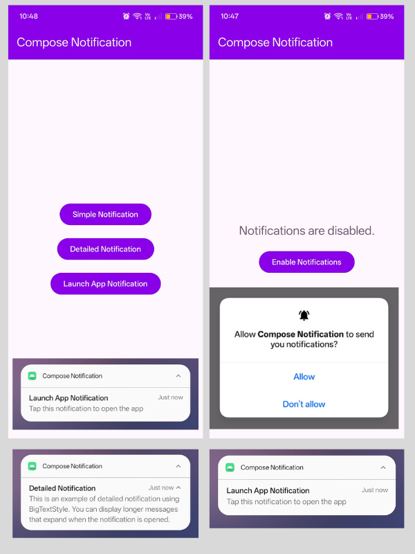

# Compose Notification 🚀

A simple **Jetpack Compose app** demonstrating notifications on Android, with **runtime permission
handling** for API 33+ (Android 13). This serves as a reference for implementing notifications in
future apps.

---

## Features ✨

* 🟢 **Simple Notification** – basic notification with a title and text.
* 📜 **Detailed Notification** – notification with expanded text using `BigTextStyle`.
* 📲 **Launch App Notification** – tap to open the app from the notification.
* 🔒 **Runtime Permission Handling** – checks for `POST_NOTIFICATIONS` permission on Android 13+, and
  gracefully handles denied permissions.
* 🎨 **Jetpack Compose UI** – modern Material3 styling for buttons, text, and scaffold.
* 🛡️ **Backward Compatible** – minSdk 28 (Android 9 Pie), notifications work by default on lower
  versions.

---

## Screenshots 📸

All app screens are combined into one image for simplicity, showing the **Home Screen**, **permission prompt**, and **example notifications**.



---

## How to Run ▶️

1. Clone the repository:

   ```bash
   git clone https://github.com/ralphmarondev/ComposeNotification.git
   ```
2. Open the project in **Android Studio**
3. Build & run on an **emulator or device** with **Android 28+**

---

### Usage 🛠️

1. Launch the app 🚀
2. On **Android 13+**, the app checks if notification permission is granted. On lower versions (
   Android 9–12), notifications are allowed by default ✅
3. If permission is **not granted**, tap **Enable Notifications** 🔔 to request it.

    * If the user permanently denied the permission, the button opens the **app’s notification
      settings** ⚙️
4. Use the buttons to trigger different notifications:

    * 🟢 **Simple Notification**
    * 📜 **Detailed Notification**
    * 📲 **Launch App Notification**

---
